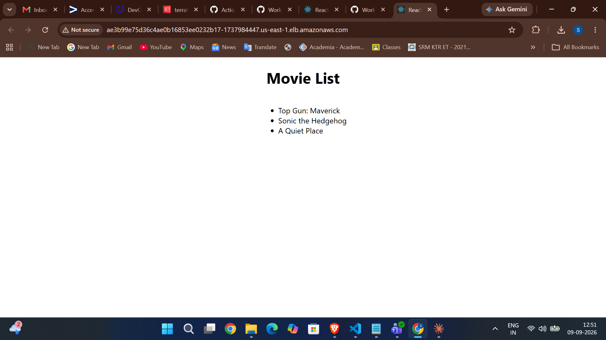
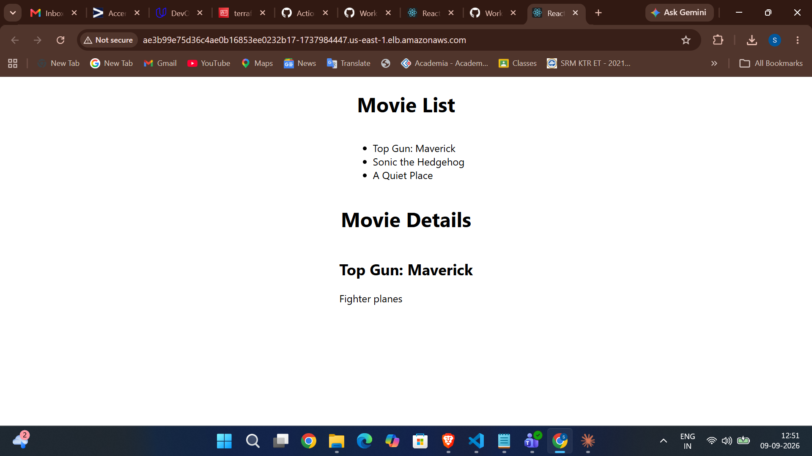
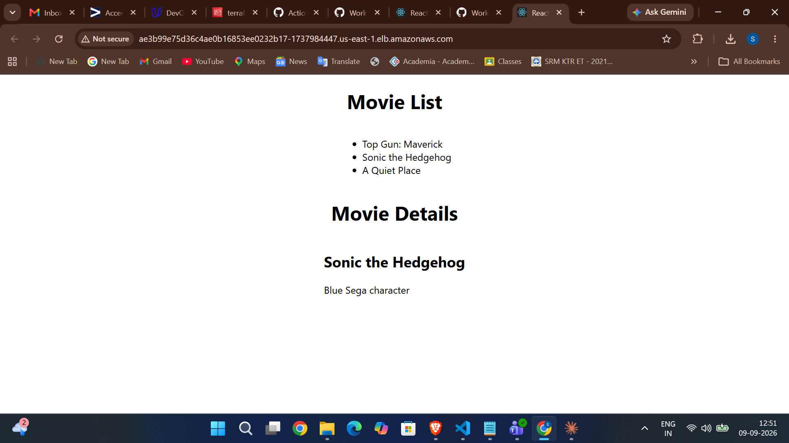
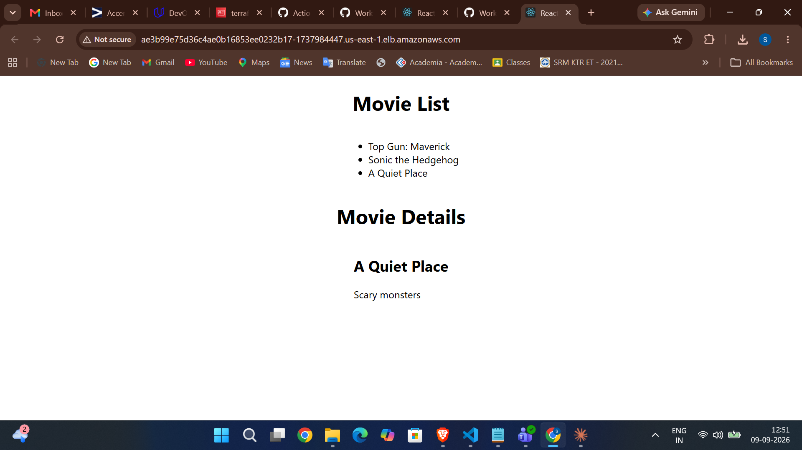
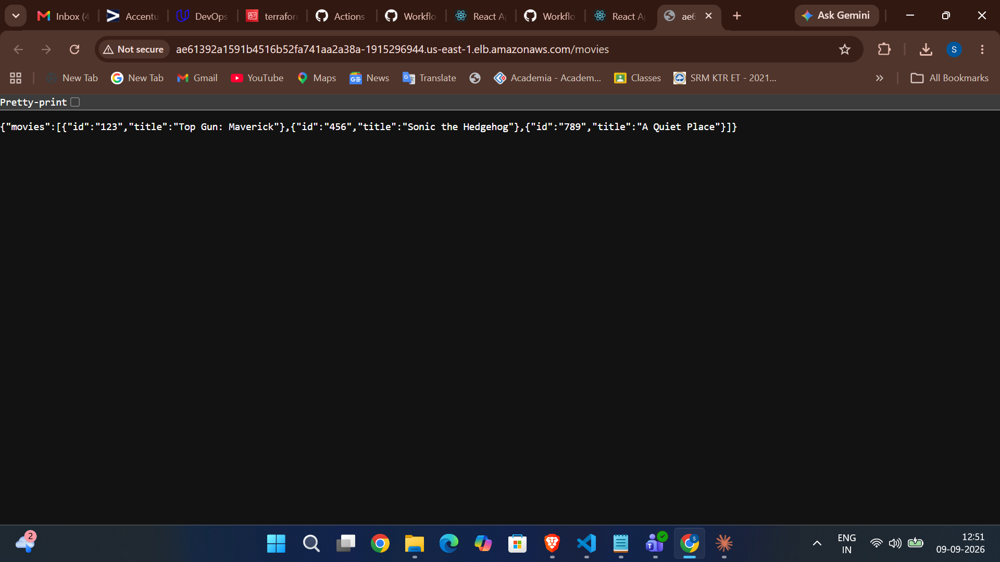
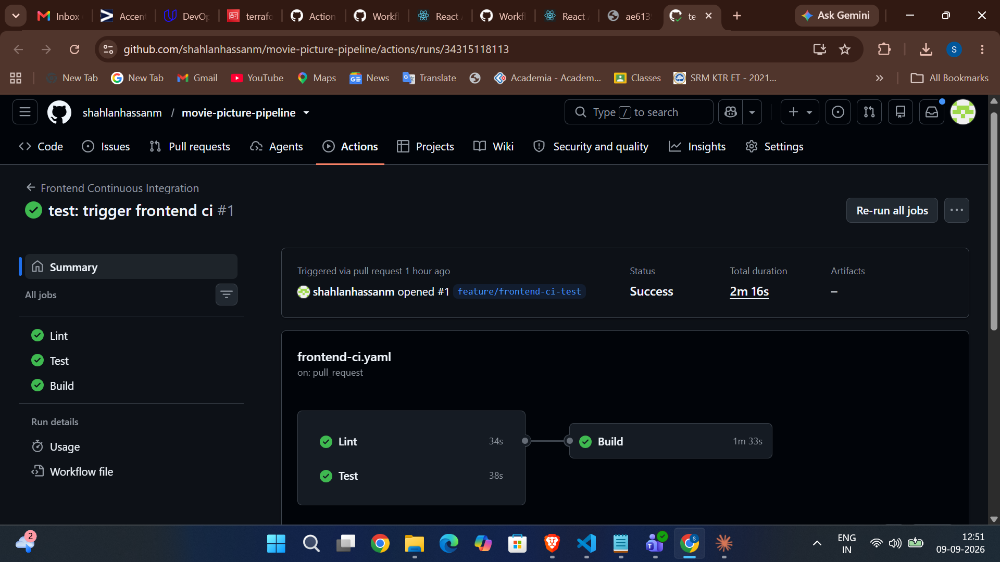
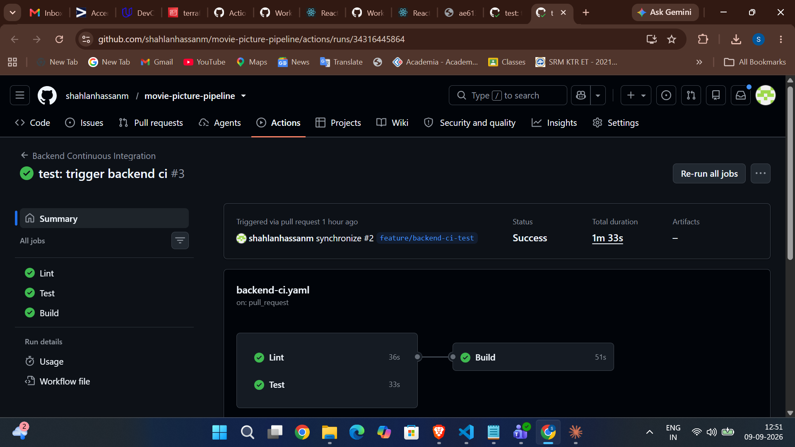
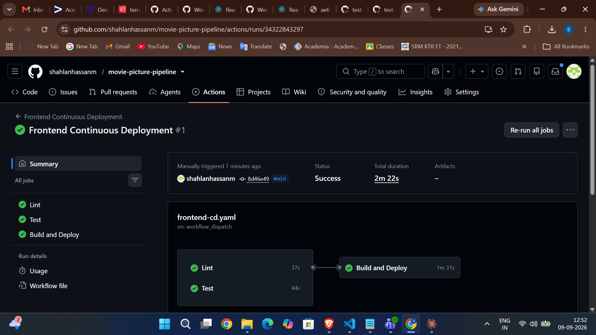
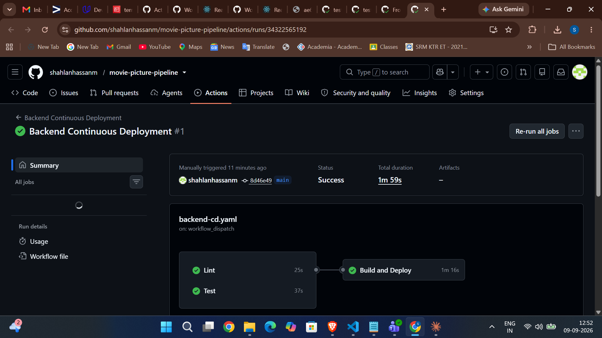
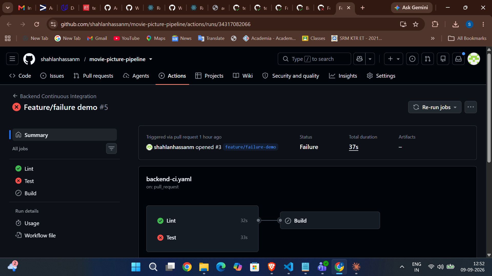

# Project Submission — Movie Picture Pipeline

Repository: https://github.com/shahlanhassanm/movie-picture-pipeline

Four GitHub Actions workflows build, test and deploy a React frontend and a
Flask backend to an Amazon EKS cluster, with images published to Amazon ECR.

## Live application URLs

| Application | URL |
| --- | --- |
| Frontend | http://ae3b99e75d36c4ae0b16853ee0232b17-1737984447.us-east-1.elb.amazonaws.com |
| Backend API | http://ae61392a1591b4516b52fa741aa2a38a-1915296944.us-east-1.elb.amazonaws.com/movies |

These point at AWS resources that are torn down after review, so the
screenshots below are the durable evidence.

## Workflows

| Workflow | File | Run | Result |
| --- | --- | --- | --- |
| Frontend Continuous Integration | [frontend-ci.yaml](.github/workflows/frontend-ci.yaml) | [34315118113](https://github.com/shahlanhassanm/movie-picture-pipeline/actions/runs/34315118113) | success |
| Backend Continuous Integration | [backend-ci.yaml](.github/workflows/backend-ci.yaml) | [34316445864](https://github.com/shahlanhassanm/movie-picture-pipeline/actions/runs/34316445864) | success |
| Frontend Continuous Deployment | [frontend-cd.yaml](.github/workflows/frontend-cd.yaml) | [34322843297](https://github.com/shahlanhassanm/movie-picture-pipeline/actions/runs/34322843297) | success |
| Backend Continuous Deployment | [backend-cd.yaml](.github/workflows/backend-cd.yaml) | [34322565192](https://github.com/shahlanhassanm/movie-picture-pipeline/actions/runs/34322565192) | success |

AWS credentials are read exclusively from GitHub Secrets
(`secrets.AWS_ACCESS_KEY_ID`, `secrets.AWS_SECRET_ACCESS_KEY`) via
`aws-actions/configure-aws-credentials`; ECR authentication uses
`aws-actions/amazon-ecr-login`. No credentials appear in any workflow file.

## Application running on the cluster

### Frontend displaying the movie list



Selecting a movie fetches its details from the backend API, confirming the
`REACT_APP_MOVIE_API_URL` build argument was baked in correctly:







### Backend API returning the movie list



```json
{"movies":[{"id":"123","title":"Top Gun: Maverick"},{"id":"456","title":"Sonic the Hedgehog"},{"id":"789","title":"A Quiet Place"}]}
```

## Pipelines passing

### Frontend Continuous Integration



### Backend Continuous Integration



### Frontend Continuous Deployment



### Backend Continuous Deployment



## Pipelines fail when tests fail

Demonstrated on the `feature/failure-demo` branch. Lint passes, Test fails, and
the Build job is skipped rather than run — the `needs` gate holding as intended.

### Frontend Continuous Integration — failing


### Backend Continuous Integration — failing



## Images published to Amazon ECR

Both images are tagged with the git SHA of the deployed commit,
`8d46e4925486dfcbbbc38c6c711306d3303f8e4e`:

```
$ aws ecr describe-images --repository-name backend  --query "imageDetails[].imageTags" --output text
8d46e4925486dfcbbbc38c6c711306d3303f8e4e

$ aws ecr describe-images --repository-name frontend --query "imageDetails[].imageTags" --output text
8d46e4925486dfcbbbc38c6c711306d3303f8e4e
```

## Workloads on the EKS cluster

```
$ kubectl get deploy,svc,pods
NAME                       READY   UP-TO-DATE   AVAILABLE   AGE
deployment.apps/backend    1/1     1            1           12m
deployment.apps/frontend   1/1     1            1           9m19s

NAME                 TYPE           CLUSTER-IP       EXTERNAL-IP                                                               PORT(S)        AGE
service/backend      LoadBalancer   172.20.60.26     ae61392a1591b4516b52fa741aa2a38a-1915296944.us-east-1.elb.amazonaws.com   80:31472/TCP   12m
service/frontend     LoadBalancer   172.20.229.254   ae3b99e75d36c4ae0b16853ee0232b17-1737984447.us-east-1.elb.amazonaws.com   80:31618/TCP   9m19s
service/kubernetes   ClusterIP      172.20.0.1       <none>                                                                    443/TCP        55m

NAME                            READY   STATUS    RESTARTS   AGE
pod/backend-5dd9d98574-bhv7t    1/1     Running   0          12m
pod/frontend-555d9b9d98-b2t27   1/1     Running   0          9m19s
```
